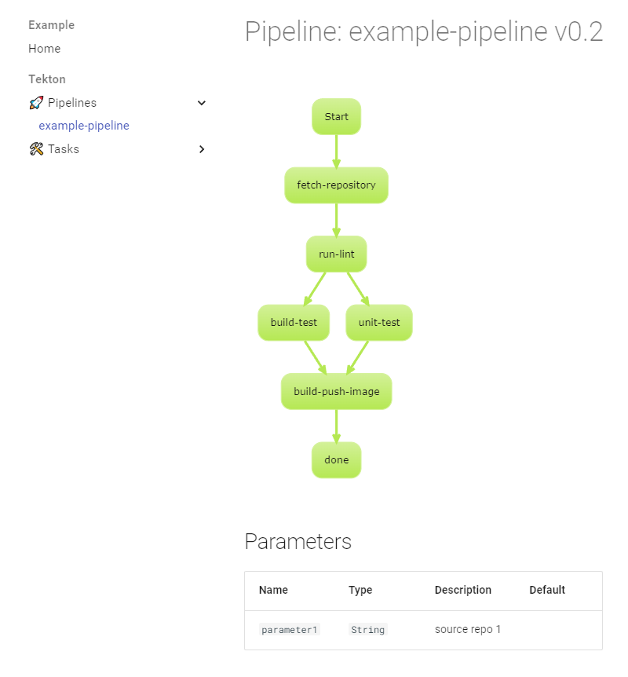

# MkDocs Pipeline Visualizer Example

This example demonstrates how to use the MkDocs Pipeline Visualizer plugin together with Spotify TechDocs to generate documentation for Tekton pipelines and tasks.

## Getting Started

1. Install the required dependencies:

```console
uv sync --dev
```

If you used this repo before the package layout changed, refresh the local install first:

```console
uv sync --dev --reinstall-package mkdocs-pipeline-visualizer
```

2. Start the MkDocs development server:

```console
uv run serve-example
```

4. Open your web browser and visit `http://127.0.0.1:8000/` to view the generated documentation.

## Customizing the Example

- The `mkdocs.yaml` file in this directory contains the configuration for MkDocs and the Pipeline Visualizer plugin.

- The `tekton` directory contains example pipeline and task YAML files. You can add your own Tekton resource files to this directory to see how they are visualized.

## Pipeline Visualization


